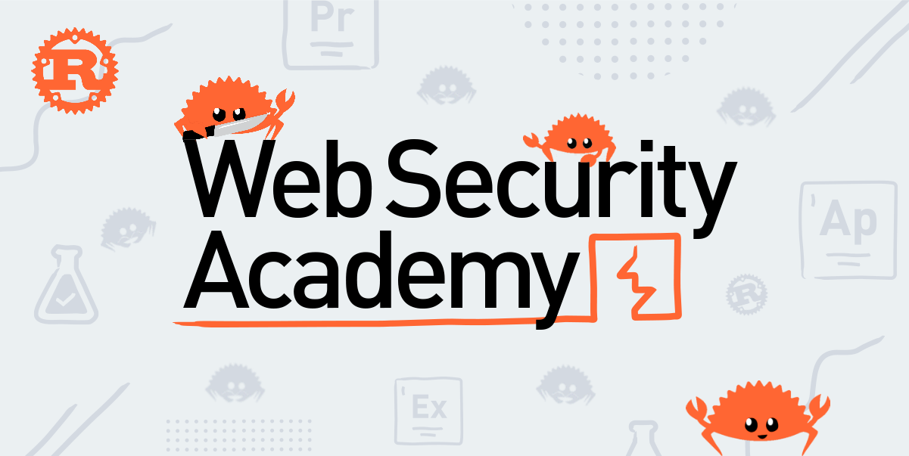

## Disclaimer

This repository is for educational purposes only, and I am not responsible for using any of the techniques described here for illegal usage.

## Using Burp Suite for Labs

You can, of course, solve the labs using Burp Suite, but this repository is for those who want to take their scripting skills up to a higher level.

This repository assumes that you already know how to solve the labs and want to solve them using scripts in order to practice writing robust ones.
You may not find a detailed description of how the labs should be solved but you will find a detailed description of how the scripts were written.

## Why Rust? 🦂

Rust gives you speed (as if you write C code) and a high level of interfaces and API (as if you write Python code).

Although learning Rust can be challenging due to its steep learning curve, with time, you will develop a deep appreciation for the language and become proficient in writing code with it.

You will find that it is not a difficult task to write a script, and it will be far faster than Python.

For this reason, Rust wins!

#### Rust makes it harder?

You may think that solving the labs using Burp Suite is much faster and easier than writing such slightly complex scripts. You are right!

You write such scripts for easy tasks, just to practice the language features and become familiar with crates (a term used in the Rust ecosystem like libraries in Python or modules in JavaScript) that you will often use.

After you master easy tasks, you will notice that your language skills are much better and you can write not only robust scripts faster in runtime speed but also faster in writing them!

## Rust for Penetration Testing 👨🏻‍💻

Rust is a relativly new language compared to Python and it's not involved as much as Python in penetration testing yet.

Due to its power and speed, it evolved rapidly in much areas. Big companies now are migrating to Rust ( If they are not alreay did).
We, penetration testers, will also make it evolves in our field leveraging its power and making our tests more efficient than ever. That's why I created this repositroy.

If you are not interested in speeding up automation as much as possible, then this repository is not for you.

## Multi-threaded Programming 🚀

Mutli-threaded programming is very easy in Rust. There are ready crates for you to use although writing one from scratch is straightforward.

You can leverage multi-threading to achieve significantly higher speed in your tests. In fact, you can write a script that is **10** times faster than a single-threaded one. That is why I have written a multi-threaded version for the labs that require the use of brute force technique to solve them.

If you find the scripts too hard, it is advisable to stick with single-threaded ones. Even with a single thread, they will still be faster than using Python.

## Error Handling

Since this repository is intended for educational purposes and not for production, I have omitted some error handling, which I believe will not significantly impact your testing of the script. This decision represents a trade-off between addressing every possible scenario and prioritizing simplicity.

## Reporting Issues

If you encounter any issues or have suggestions for improvement while working with these scripts, feel free to open an issue.
Your feedback is valuable, and I appreciate your contributions to enhance the learning experience for everyone.

## Rust Alternatives

At the begining, you may find that it so difficult to write Rust code and you will want to get back to python. Don't give up easly!

If you insist and don't get comfrotable with Rust, you can check out [WebSecurity Academy with Python](https://github.com/elqal3awii/WebSecurity-Academy-with-Python) repository in which I have solved the same labs using Python.

## Support & Star ✨

If you appreciate the work and find it valuable, please consider giving this repository a star. Your support is greatly appreciated and helps to showcase the popularity and significance of the project. Thank you for your interest and support!

## Resources

- [Jim Blandy, Jason Orendorff, and Leonora F.S. Tindall. (2021). *Programming Rust*. O’Reilly.](https://www.goodreads.com/book/show/25550614-programming-rust?ref=nav_sb_ss_2_16)
- [Steve Klabnik, Carol Nichols. (2018). *The Rust Programming Language*. no strach press.](https://doc.rust-lang.org/book/title-page.html)
- [Rust Documentation](https://doc.rust-lang.org/beta/)
